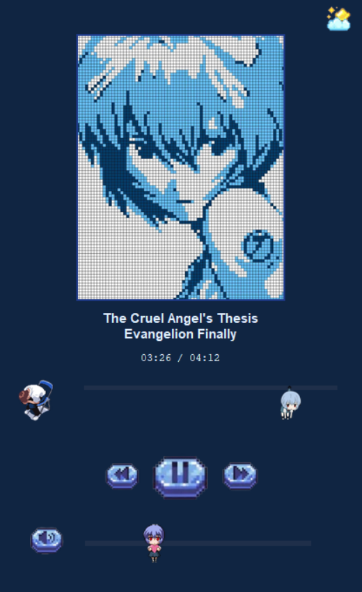

# REI Music Player

 

Pixel-art desktop music player inspired by Rei Ayanami from *Neon Genesis Evangelion*. The interface uses a pastel blue palette, animated light/dark themes, and custom sprite work to keep playback controls cute and cozy.

## Features
- **Rei-themed pixel art:** Canvas scenery, decorative sprites, and custom slider knobs designed around Rei’s aesthetic.
- **Animated theme toggle:** Seamless transition between pastel daylight and deep-blue night modes using smooth color interpolation.
- **Playlist playback:** Loads local `.mp3` files (sorted with EVA-favorites first) and displays metadata-driven progress.
- **Custom controls:** Heart-shaped volume slider, Rei drag progress knob, mute toggle, and autoplay-safe seeking.
- **Responsive canvas:** Sakura petals, swaying grass, and floating décor update continuously for a lively scene.

## Project Layout
```
REI-Music-Player/
├─ REI_music_player.py   # Main application entry point
├─ assets/               # UI icons (play/pause, arrows, volume)
├─ deco/                 # Pixel art for scene + slider decorations
├─ music/                # Place your MP3 files here (ignored by git)
├─ requirements.txt      # Python dependencies
└─ README.md             # This document
```

## Prerequisites
- Python 3.10+ (3.11 recommended)
- pip for dependency installation
- Local `.mp3` files (not included)

Install dependencies:
```bash
pip install -r requirements.txt
```

## Running the Player
```bash
python REI_music_player.py
```

Place MP3 files inside the `music/` directory before launching. The player orders tracks so “Cruel Angel’s Thesis” and “Komm, süsser Tod” show up first when present.

### Controls
- **Play / Pause:** Click the main Rei play button.
- **Next / Previous:** Arrow buttons beside play.
- **Seek:** Drag the Rei drag progress slider.
- **Volume:** Adjust the heart slider; click the volume icon to mute/unmute.
- **Theme toggle:** Tap the moon/star icon to switch between light and dark modes.

## Customisation
- Replace images in `assets/` or `deco/` with your own sprites (keep filenames and sizes consistent for best results).
- Update `music/` with any legal audio you want to play; the folder is git-ignored so your tracks stay local.
- Tweak colours inside `REI_music_player.py` by editing `LIGHT_THEME` and `DARK_THEME` dictionaries.

## Legal & Asset Notes
- The code is original, but the player references the character Rei Ayanami; ensure your usage respects relevant trademarks and copyrights.
- Do not commit licensed audio. `.gitignore` already excludes `music/*.mp3` from version control.
- This fan project is strictly non-commercial; it generates no revenue, and no ownership over Evangelion IP is claimed.
- If rights holders request changes or takedown, please respect their guidance and update/remove the material.

## Development Tips
- Run `python -m py_compile REI_music_player.py` to quick-check syntax.
- Use the virtual environment `.venv/` (ignored by git) for isolated dependency management.
- Contributions are welcome—please document new widgets/assets in this README.

Enjoy the playlist, Commander.
